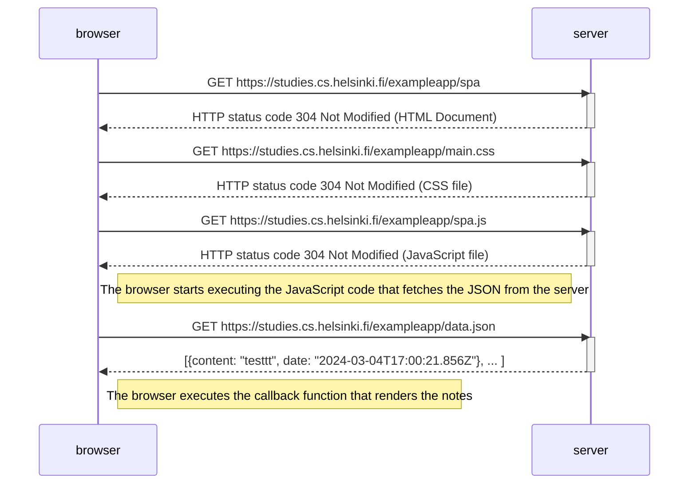

```mermaid
sequenceDiagram

participant browser
participant server

browser->>server: GET https://studies.cs.helsinki.fi/exampleapp/spa
activate server
server-->>browser: HTTP status code 304 Not Modified (HTML Document)
deactivate server

browser->>server: GET https://studies.cs.helsinki.fi/exampleapp/main.css
activate server
server-->>browser: HTTP status code 304 Not Modified (CSS file)
deactivate server

browser->>server: GET https://studies.cs.helsinki.fi/exampleapp/spa.js
activate server
server-->>browser: HTTP status code 304 Not Modified (JavaScript file)
deactivate server

Note right of browser: The browser starts executing the JavaScript code that fetches the JSON from the server

browser->>server: GET https://studies.cs.helsinki.fi/exampleapp/data.json
activate server
server-->>browser: [{content: "testtt", date: "2024-03-04T17:00:21.856Z"}, ... ]
deactivate server

Note right of browser: The browser executes the callback function that renders the notes
```